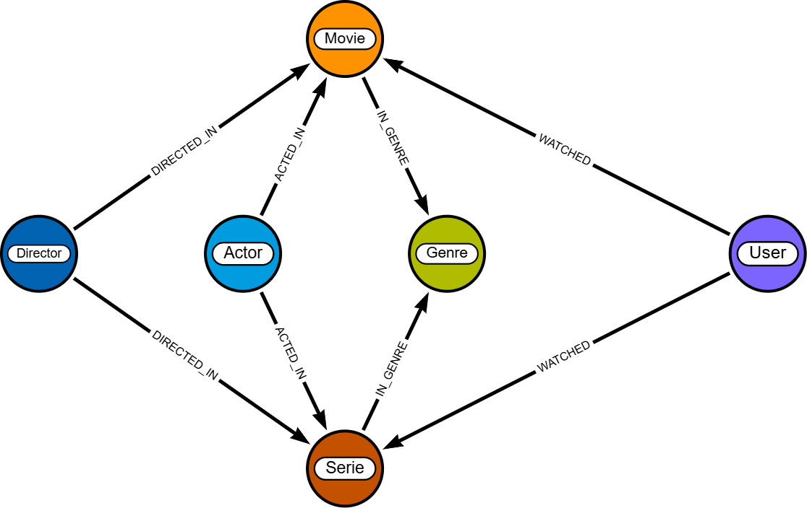
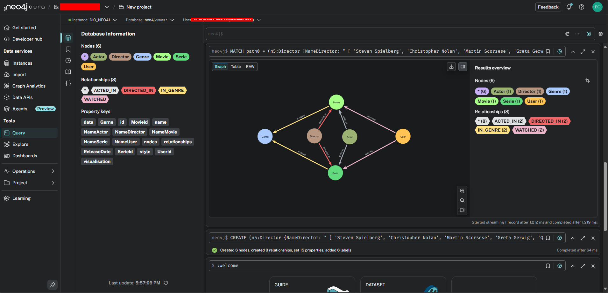

# 🎬 Desafio de Projeto: Modelagem de Dados em Grafos de um Serviço de Streaming

Este repositório contém a solução para o desafio de modelagem de um banco de dados em grafo (Neo4j) para um novo serviço de streaming, com foco em seu sistema de recomendação. Desafio proposto pelo Bootcamp _Neo4J - Análise de Dados com Grafos_ em parceria com com [Dio.ME](https://www.dio.me/)

## 1. O Problema

Você foi contratado por um novo serviço de streaming de filmes e séries e sua primeira tarefa é projetar o banco de dados. Diferente dos sistemas tradicionais, a empresa quer focar nos relacionamentos para criar um sistema de recomendação poderoso.

## 2. O Desafio

Modele e crie um pequeno grafo de conhecimento para este serviço.
O modelo deve incluir:

- **Entidades (Nós):** `User`, `Movie`, `Serie`, `Genre`, `Actor`, `Director`.
- **Conexões (Relacionamentos):** `WATCHED` (com propriedade `rating`), `ACTED_IN`, `DIRECTED`, `IN_GENRE`.

## 3. Solução Proposta

### 3.1. Modelo do Grafo

O modelo de grafo foi projetado para conectar usuários ao conteúdo que eles assistem e conectar o conteúdo a seus metadados (gênero, elenco, direção). Isso permite consultas complexas de recomendação, como "mostrar filmes do mesmo gênero que o usuário gostou" ou "recomendar séries com o mesmo ator de um filme que o usuário assistiu".

**Diagrama do Modelo:**



---

### 3.2. Scripts Cypher

Os scripts Cypher estão separados em dois arquivos para melhor organização: constraints (regras) e população (dados).

- `01-constraints.cyp`: Cria os Nós e os Relacionamentos.
- `02-populate.cyp`: Popula o banco de dados com dados de exemplo, criando nós individuais para cada entidade e, em seguida, criando os relacionamentos entre eles.

```
Pontuando que os scripts foram gerados pelo Export Cypher do site https://arrows.app/
```

---

## 4. Estrutura do Repositório

Você pode representar a árvore assim no Markdown usando um bloco de código:

```text
/
├── scr/
│   ├── img_arrow.png            # Seu diagrama do arrows.app
│   ├── img_Neo4j.png            # Seu diagrama no Neo4j
│   └── img_Neo4jFinal.png       # Print do resultado no Neo4j
├── 01-constraints.cyp           # Script de criação de nós e relacionamentos
├── 02-populate.cyp              # Script de população do banco
└── README.md
```

## 5. 🚀 Como Usar

1.  **Configurar o Banco:** Certifique-se de ter uma instância do Neo4j ativa.
2.  **Executar Constraints:** Copie e cole o conteúdo do arquivo `01-constraints.cyp` no seu browser Neo4j e execute.
3.  **Popular o Banco:** Após o primeiro script, copie e cole o conteúdo do `02-populate.cyp` e execute.
4.  **Explorar:** Seu grafo agora está populado. Use as consultas de exemplo abaixo para explorá-lo.

---

## 6. 📊 Resultado no Neo4j

Abaixo está um print da visualização do grafo após a execução dos scripts de população.



---

## 7. ✍️ Autor

- **[Bruno Coelho]** - _Desenvolvimento e Modelagem_ - [@brunucoelho](https://github.com/seu-usuario-github)

---

## 8. ✨ Inspiração

Este projeto foi desenvolvido como solução para um desafio prático de modelagem de grafos.

- **Desafio Proposto por:** Matheus Ferreira
- **GitHub:** [@matheusferreirads](https://github.com/matheusferreirads)
